

  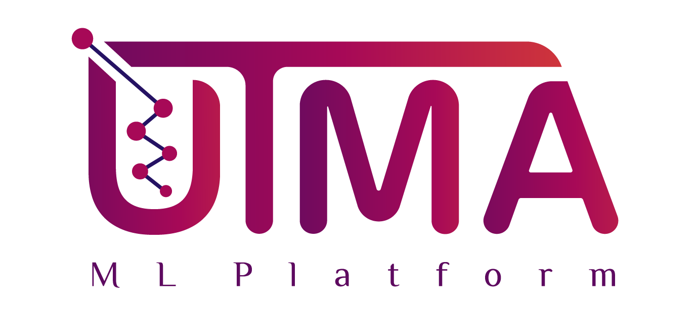
  <h3 align="center">UTMA Machine Learning Platform</h3>

  
<h2 style="display: inline-block">İçerik</h2>

  <ol>
    <li>
      <a href="#proje-hakkında">Proje Hakkında</a>
      <ul>
        <li><a href="#özet">Özet</a></li>
      </ul>
      <ul>
        <li><a href="#kullanılan-teknolojiler">Kullanılan Teknolojiler</a></li>
      </ul>
    </li>
    <li>
      <a href="#gerçekleştirilen-algoritmalar">Gerçekleştirilen Algoritmalar</a>
    </li>
    <li>
      <a href="#veri-seti-filtreleri">Veri Seti Filtreleri</a>
      <ul>
      <li><a href="#etiket-kodlama">Etiket Kodlama</a></li>
      <li><a href="#frekans-kodlama">Frekans Kodlama</a></li>
      <li><a href="#one-hot-kodlama">One-hot Kodlama</a></li>
      <li><a href="#binary-kodlama">Binary Kodlama</a></li>
      <li><a href="#tarih-nümerik-cevirici">Tarih Nümerik Çevirici</a></li>
      <li><a href="#eksik-alan-doldurma">Eksik Alan Doldurma</a>
      <ul>
      <li><a href="#rastgele">Rastgele</a></li>
      <li><a href="#ortalamaya-göre">Ortalamaya Göre</a></li>
      <li><a href="#sabit">Sabit</a></li>
      </ul>
      </li>
      <li><a href="#ortalama-düzenleme">Ortalama Düzenleme</a></li>
      <li><a href="#tekrarları-kaldırma">Tekrarları Kaldırma</a></li>
      <li><a href="#aralığa-göre-veri-silme">Aralığa Göre Veri Silme</a></li>
      </ul>
    </li>
    <li><a href="#uygulamadan-görseller">Uygulamadan görseller</a>
      <ul>
        <li><a href="#anasayfa">Anasayfa</a></li>
        <li><a href="#veri-seti-ekleme">Veri Seti Ekleme</a></li>
        <li><a href="#kategorik-veri-düzenleme">Kategorik Veri Düzenleme</a></li>
        <li><a href="#nümerik-veri-düzenleme">Numerik Veri Düzenleme</a></li>
        <li><a href="#veri-satırı-düzenleme">Veri Satırı Düzenleme</a></li>
        <li><a href="#veri-setlerini-görüntüleme">Veri Setlerini Görüntüleme</a></li>
        <li><a href="#görev-ekleme">Görev Ekleme</a></li>
        <li><a href="#görevleri-görüntüleme">Görevleri Görüntüleme</a></li>
        <li><a href="#sonuç-görüntüleme">Sonuç Görüntüleme</a></li>
        <li><a href="#sınıf-görselleştirmesi-sonucu">Sınıf Görselleştirmesi Sonucu</a></li>
        <li><a href="#sınıflandırma-raporu-sonucu">Sınıflandırma Raporu Sonucu</a></li>
        <li><a href="#optimum-parametreler-sonucu">Optimum Parametreler Sonucu</a></li>
      </ul>
      </li>
    <li><a href="#lisans">Veri Tabanı Tasarımı</a></li>
    <li><a href="#lisans">Lisans</a></li>
    <li><a href="#geliştiriciler">Geliştiriciler</a></li>
  </ol>

<!-- ABOUT THE PROJECT -->
## Proje Hakkında

### Özet
Kullanıcıların Yazılım, Makine Öğrenmesi gibi teknolojiler bilmesine gerek kalmaksızın hizmet sağlanabilmesini konu alan UTMA Otomatik Makine Öğrenmesi Platformu, Makine Öğrenmesi algoritmalarının Web Sitesinde otomatik olarak sunulması olarak tanımlanmaktadır. Bu sistem sayesinde veri bilimi algoritmaları web sitesinde sunulur. Bu algoritmaların optimizasyonları yapılır ve hangi modelin seçileceği otomatik olarak belirlenir Bu çalışma ile Weka ve BigMl benzeri bir uygulama geliştirilmiştir. Burada kullanıcının işlemleri rahatça yapabilmesi ve yaptığı işlemi anlayabilmesi için görselleştirme tekniklerinden faydalanılmıştır.

### Kullanılan Teknolojiler

* [Angular](https://github.com/angular)
* [Angular Material](https://github.com/angular/components)
* [Django](https://github.com/django/django)
* [Django Rest Framework](https://github.com/encode/django-rest-framework)
* [Django JWT Validator](https://github.com/jpadilla/django-rest-framework-jwt)
* [Numpy](https://github.com/numpy/numpy)
* [Pandas](https://github.com/pandas-dev/pandas)
* [Scikit-learn](https://github.com/scikit-learn/scikit-learn)
* [Hyperopt](https://github.com/hyperopt/hyperopt)
* [Hyperopt-sklearn](https://github.com/hyperopt/hyperopt-sklearn)

## Gerçekleştirilen Algoritmalar

## Veri Seti Filtreleri

### Etiket Kodlama
Etiket kodlama filtresi ile kategorik özelliklerimizin algoritma tarafından anlaşılabilecek şekilde sayısal biçime dönüştürmeye yarar. Kategorik değerler ve oluşturulacak sayısal değerler arasında ilişki bulunmaz. Bu yüzden rastgele bir sırayla her farklı kategoriye denk, tekrar etmeyecek şekilde sayısal değerler oluşturur.
 
 

### Frekans Kodlama
Etiket kodlama gibi bu kodlamada da kategorik sayısala dönüştürülür. Bu filtre her bir kategorik değerin kaç kere tekrar ettiği bulur. Diğer tüm kategorilerle yüzdelik olarak dağılımları hesaplanır ve o kategorik değerler yerine bu dağılımdan ortaya çıkan 0-1 aralığında değerler yazılır.
 
 

### One-hot Kodlama
One-hot kodlama filtresi ile kategorik değerlerden oluşan sütunları ikili değerler olarak temsil edilebilir hale getirir. Öncelikle her kategorik değeri tamsayı değerleriyle eşleştirir. Daha sonra her bir tamsayı değeri 1 ile işaretler ve işaretlenmiş tamsayı indeksi dışındaki tüm değerleri sıfır olan bir vektör olarak temsil edilir hale getirir.
 
 

### Binary Kodlama
One-hot kodlama filtresi kategorik değer sayısı yüksek olan sütunlarda kullanıldığında çok fazla yeni sütun oluşturacağından binary kodlama filtresi kullanılabilir. Bu filtre tüm kategorik değerleri 1’den başlayarak artan tamsayılar ile eşleştirir. Daha sonra tamsayı değerler ikili sayı sistemi karşılığına çevrilir. Ortaya çıkan ikili sayıların hane sayısı kadar yeni sütun oluşturulur. İkili sayıların değerlerini bu sütunlara yazan hale çevirir.
 
 

### Tarih Nümerik Çevirici
Tarih değerleri içeren bir sütun seçilerek bu filtre kullanılabilir. Filtre bir sütun için kullanıldığında o sütundaki tarihi değerleri 1 Ocak 1970’ten, o tarihe kadar geçen saniye karşılıklarına çevirir.
 
 

### Eksik Alan Doldurma
Bu filtre veri setinde seçilen bir sütundaki eksik alanları doldurmayı sağlar.  Üç farklı yöntem ile bu filtre kullanılabilir.
 
 

#### Rastgele
Filtre rastgele seçeneği ile kullanıldığında seçilen sütundaki tüm boş alanları rastgele değerler ile doldurmayı sağlar.
 
 

#### Ortalamaya Göre
Seçilen sütun bir sayısal sütun ise eksik olan alanları o sütunun ortalama değerine göre doldurur. Kategorik verilerden oluşan bir sütün ise kategorik değerlerin frekans oranları optimum düzeyde sabit tutmaya çalışarak doldurur.
 
 

#### Sabit
Bu filtre seçilen sütundaki değerleri kullanıcının girdiği sabit bir değer ile doldurmaya yarar.
 
 

### Ortalama Düzenleme
Bu filtre kullanılarak bir sütundaki tekrar eden yani eşsiz olmayan değerlere sahip satırlar silinebilir.
 
 

### Tekrarları Kaldırma
Bu filtre kullanılarak bir sütundaki tekrar eden yani eşsiz olmayan değerlere sahip satırlar silinebilir.
 
 

### Aralığa Göre Veri Silme
Bu filtre sayısal verilerden oluşan sütunlar veri silmeyi ve veri setini küçültmeyi sağlar. Kullanıcıdan alınan aralık değerlerinin içinde kalan tüm satırları silmeye yarar.
 
 

## Uygulamadan Görseller

### Anasayfa
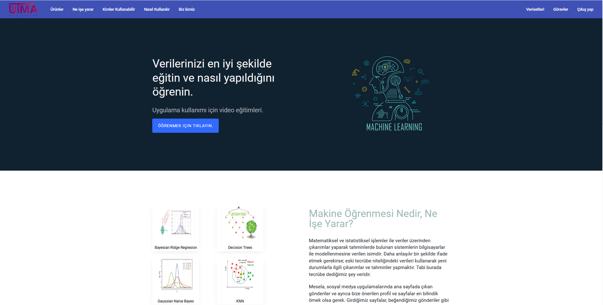
 
 

### Veri Seti Ekleme

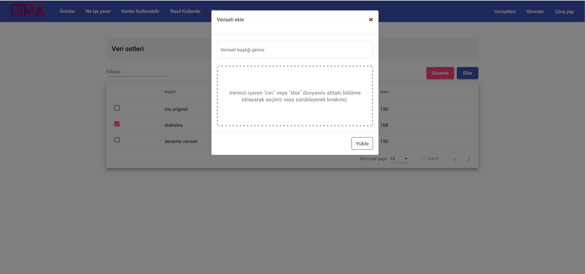
.csv veya .xslx formatında olan verisetinizi isimlendirerek ekleyin.
 
 

### Kategorik Veri Düzenleme

Bu aşamada oluşturduğunuz veri setindeki kategorik alanları görüntüleyebilir veya seçtiğiniz kategori üzerinde filtreleri uygulayabilirsiniz.

 
 

### Nümerik Veri Düzenleme

Bu aşamada oluşturduğunuz veri setindeki nümerik alanları görüntüleyebilir veya seçtiğiniz nümerik veri sütunu üzerinde eksik alan doldurma filtrelerini uygulayabilirsiniz.
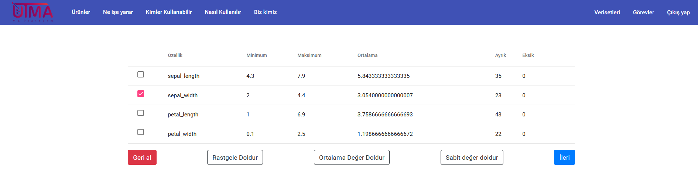
 
 

### Veri Satırı Düzenleme

Veri seti ekleme sürecinin son kısmında tüm veri setinizi görüntüleyebilir, aynı zamanda ekleme, filtreleme, düzenleme veya silme işlemlerini yapabilirsiniz.
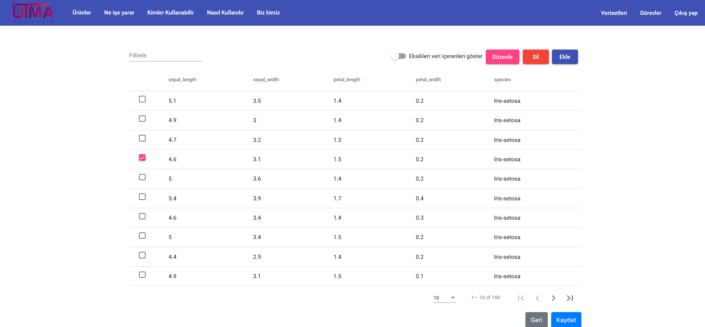
 
 

### Veri Setlerini Görüntüleme

Oluşturduğunuz tüm veri setlerini görüntüleyebilir veya düzenleyebilirsiniz.
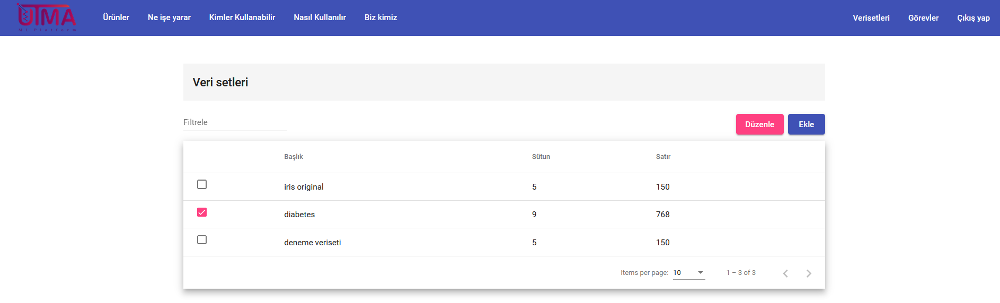
 
 

### Görev Ekleme

Daha önceden ayarladığınız herhangi bir veri setini, istediğiniz bir makina öğrenmesi algoritması ile çalıştırmak üzere sıraya alır.
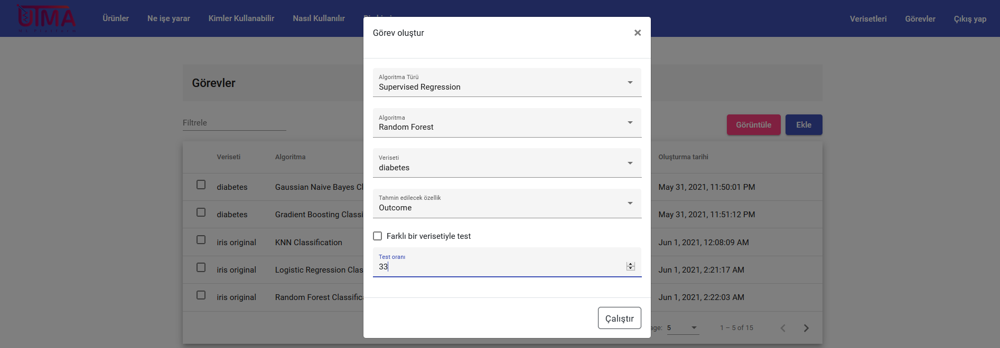
 
 

### Görevleri Görüntüleme

Beklemede olan, aktif halde veya tamamlanmış olan görevleri listeler.
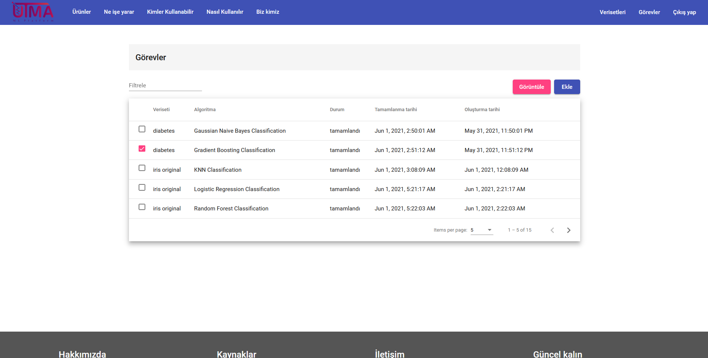
 
 

### Sonuç Görüntüleme

Tamamlanan görevin sonuçlarını, görselleştirmelerini, raporlarını veya optimize edilmiş halini görüntüler.
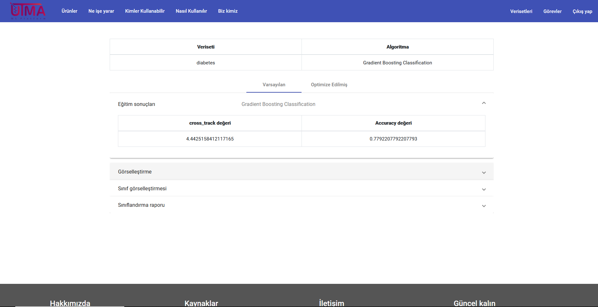
 
 

### Sınıf Görselleştirmesi Sonucu

Tamamlanan görev sonucunun varsayılan ve optimize edilmiş halinin sınıf görselleştirmesi.
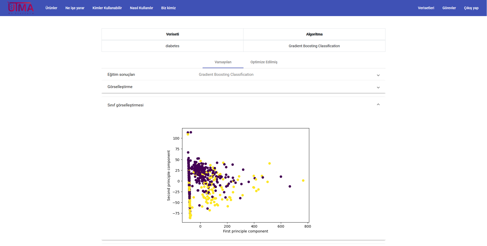
 
 

### Sınıflandırma Raporu Sonucu

Tamamlanan görev sonucunun varsayılan ve optimize edilmiş halinin sınıflandırma raporu.
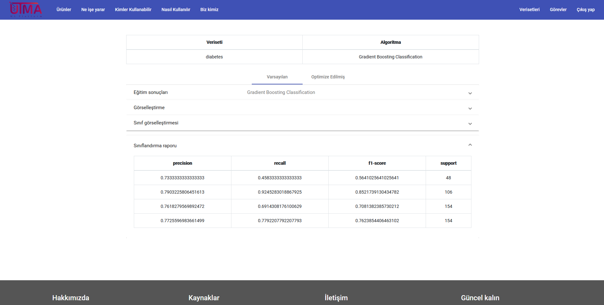
 
 

### Optimum Parametreler Sonucu

Tamamlanan görev sonucunun olarak optimum verim için kullanılması gereken parametreleri listeler.
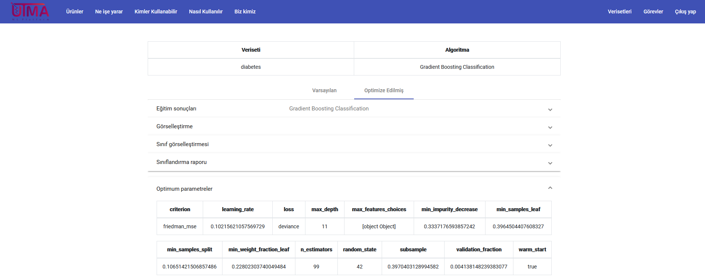
 
 

## Lisans

Distributed under the MIT License. See [LICENSE][license-url] for more information.

## Geliştiriciler

Hakan Eryücel - hakanerycl@gmail.com [![LinkedIn][linkedin-shield]][linkedin-hakan-url]

Muhammet Çepi - muhammet@gmail.com [![LinkedIn][linkedin-shield]][linkedin-muhammet-url]

Rayan Alheraki - rayan@gmail.com [![LinkedIn][linkedin-shield]][linkedin-rayan-url]

Mahsun Akay - mahsun@gmail.com [![LinkedIn][linkedin-shield]][linkedin-mahsun-url]

[license-url]: https://github.com/Hakan-er/utma/blob/master/LICENSE.md
[linkedin-shield]: https://img.shields.io/badge/-LinkedIn-black.svg?style=for-the-badge&logo=linkedin&colorB=555
[linkedin-hakan-url]: https://www.linkedin.com/in/hak-er/
[linkedin-muhammet-url]: https://www.linkedin.com/in/muhammetcepi/
[linkedin-rayan-url]: https://www.linkedin.com/in/rayan-alheraki-2a3334107/
[linkedin-mahsun-url]: https://www.linkedin.com/in/mahsun-akay-software-developer/